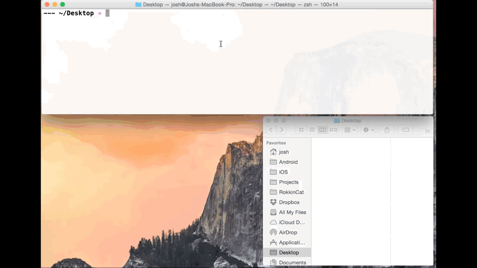
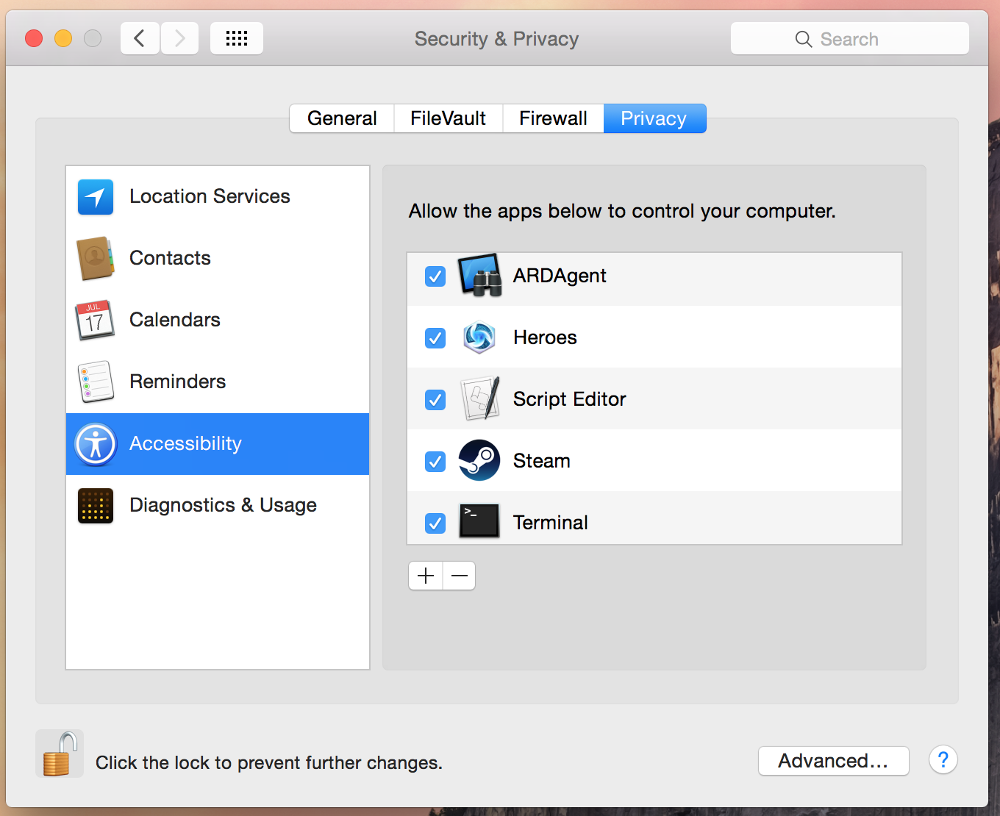

# exportation
CLI tool of easy exporting, encrypting, and decrypting of certificates and private keys.

**Important:** The `export` command will take control of your "Keychain Access" app so keep all hands off your computer while that command runs

### Example usage (with prompt)
```sh
$: exportation export
Name: RokkinCat LLC
Path to save to (default: './'): ./examples
Filename to save as (default: 'export'): dist
Password for private key (default: ''): shhh
Info  Take all hands off your computer! exportation is going to take control of 'Keychain Access'
```



### Why
- Export **and** encrypt certificates **and** private keys **into** repos
  - CI tools (may need these to distrubute builds to Apple TestFlight Beta :apple:)
  - For other developers (for when you are on vacation and they need to make a distribution build :grimacing:)

### Features in progress
- Integrate with [fastlane](https://github.com/KrauseFx/fastlane) :rocket:
- Create a separate keychain with the certificates and private keys for use on CI systems :grinning:

### Caveats
- Some phases of the script might run slow due to using AppleScript
  - Initial load may take up to 5ish seconds
  - Waiting for private key password to be entered may take up to 7ish seconds
- May need to give "Accessibility" access to **ARDAgent** and **Terminal**

## Installation

### Install gem
```sh
gem install exportation
```

### Give "Accessibility" access
- Open up "Security & Privacy" preferences
- Select "Accessibility"
- Add **ARDAgent** and **Terminal**
  - Click "+"
  - Press CMD+SHIT+G (to go to specific folder)
  - **ARDAgent** should be under `/System/Library/CoreServices/RemoteManagement/`
  - **Terminal** should be under `/Applications/Utilities/`


**You won't need to give Heroes, Script Editor, or Steam permissions for exportation** :wink:

## Commands
Exportation has three different commands: `export`, `encrypt`, and `decrypt`.

### Export from Keychain Access
**Be lazy!** `export` uses AppleScript to control the "Keychain Access" app to export a certificate and private to be used for CI (continuous integration) or for other developers.
```sh
exportation export --name "Your Company LLC"
```

### Encrypting certificate and private key
**Be safe!** `encrypt` does exactly what it says - it encrypts. It uses AES-256 to encrypt your certificate, private keys and provisioning profiles (any file really) to store safely in your repository for CIs or other developers to access. All files will be appened with a `.enc` extension.
```sh
exportation encrypt exported.cer exported.p12 --password dudethis
```

### Decrypting certificate and private key
**Be awesome!** `decrypt` decrypts your encrypted files to use on your CI or for other developers to install. *BE CAREFULL TO NOT COMMIT THESE BACK INTO YOUR REPO*
```sh
exportation decrypt exported.cer.enc exported.p12.enc --password dudethis
```

## Using the internals

### Compiling and running the AppleScript directly
*You shouldn't ever have to do this unless I messed stuff up :)*

### Compile
```sh
osacompile -o applescript/exportation.scpt applescript/exportation.applescript
```

### Run
Always put all for arguments in strings because I don't do AppleScript well :grimacing:
```sh
osascript applescript/exportation.scpt "~/directory_you_want_to_export_to/" "dist" "iPhone Distribution: Your Company LLC"  "thepassword"
```

## Author

Josh Holtz, me@joshholtz.com, [@joshdholtz](https://twitter.com/joshdholtz)

## License

exportation is available under the MIT license. See the LICENSE file for more info.
